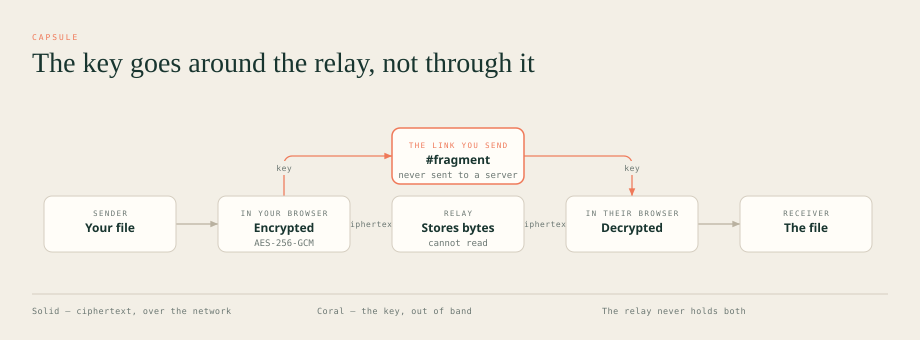
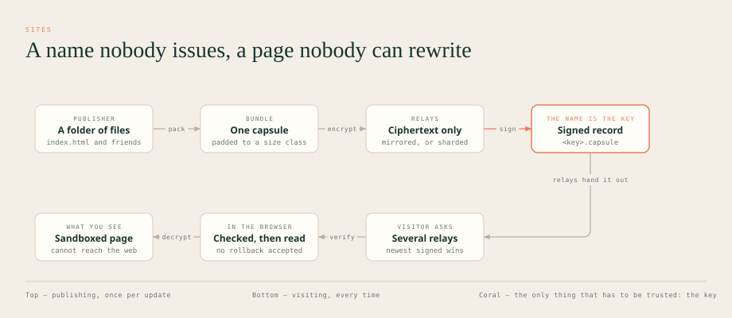
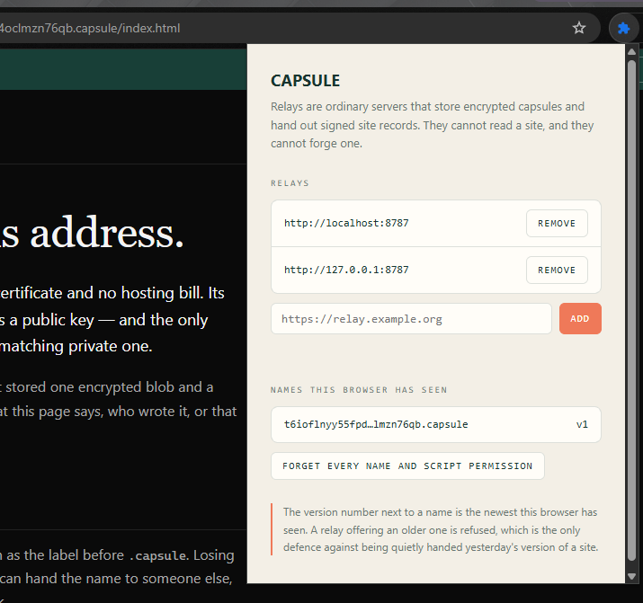

#  CAPSULE

**You pay for the connection. Everything past it should belong to everyone.**

A free, decentralised network where anyone can launch their own domain, share
files with no account and no identity attached, and stay reachable when the
Internet is not. If you already pay to be online, what is inside it should not
be for sale.

📄 [Live site](https://68.211.136.69.sslip.io/) · 🔒 [Threat model](docs/THREAT_MODEL.md) · 📊 [Compared to 21 other networks](docs/COMPARISON.md)

---

## What is it

Send someone a file. Put a website online. Both work without an account,
without paying anyone, and without asking permission, and they keep working
when the Internet does not.

|                              |                                                                                                                                                                                             |
| ---------------------------- | ------------------------------------------------------------------------------------------------------------------------------------------------------------------------------------------- |
| **Send a file**              | You get a link. Whoever you give it to can open it. The server holding the file cannot: it only ever sees scrambled bytes, and the part of the link that unscrambles them never reaches it. |
| **Publish a site**           | You get an address ending in `.capsule`. Nobody sold it to you, nobody renews it, and nobody can hand it to someone else: the address _is_ your key.                                        |
| **No Internet? Still works** | Two laptops on the same wifi find each other with no DNS and no uplink. With no network at all, a capsule becomes one file you carry on a memory stick.                                     |
| **Blocked? Still works**     | A bridge is a server the network does not list. To anyone scanning for it, it answers like an ordinary empty website.                                                                       |
| **Nothing to sign up for**   | No account, no email, no phone number, no identifier of any kind. There is nothing to log in to and nothing to delete afterwards.                                                           |



Underneath, one idea does the work: **a server should be able to hold your data
without being able to read it**, and the thing that unlocks it should never
travel the same road. Files are encrypted in your browser; the key rides in the
part of a link that browsers never send to a server.

## Why

Every mainstream file service encrypts in transit and at rest. What none of
them give up is the ability to read the file, and that ability is what gets
subpoenaed, breached, scanned and sold. The interesting question is not "is it
encrypted" but **who holds the key**.

Publishing has the same shape. A domain is rented, a certificate is issued, a
host serves the bytes: three parties, any of whom can be leaned on to make a
page disappear or say something else, and all three send an invoice.

> A relay that _could_ read your file eventually _will_ be asked to.

CAPSULE's answer is to give the server less to hold: ciphertext of an unknown
size, with no account attached, for a bounded time, and, if you ask, split
across several relays so no single one has enough to rebuild anything. Nobody
sells you a name, because nobody issues one. Nobody bills you for storage,
because a relay is a process somebody chose to run.

## Compared

|                                                  | CAPSULE | Tor | IPFS | Nostr | Matrix | Briar |
| ------------------------------------------------ | :-----: | :-: | :--: | :---: | :----: | :---: |
| Server cannot read the content                   |   ✅    |  ~  |  ❌  |  ❌   |   ~    |  ✅   |
| No account, no identifier                        |   ✅    | ✅  |  ❌  |  ❌   |   ❌   |  ❌   |
| Content size hidden from the host                |   ✅    | ❌  |  ❌  |  ❌   |   ❌   |  ❌   |
| Resists end-to-end timing correlation            |   ✅    | ❌  |  ❌  |  ❌   |   ❌   |   ~   |
| Split so no single host has enough               |   ✅    | ❌  |  ❌  |  ❌   |   ❌   |  ❌   |
| Self-certifying site names                       |   ✅    | ✅  |  ~   |  ❌   |   ❌   |  ❌   |
| Pages cannot phone home                          |   ✅    |  ~  |  ❌  |  ❌   |   ❌   |  ❌   |
| **Works with no internet at all**                |   ✅    | ❌  |  ❌  |  ❌   |   ❌   |  ✅   |
| **Censorship-resistant transport**               |   ✅    | ✅  |  ~   |   ~   |   ❌   |  ✅   |
| **General-purpose TCP tunnel**                   |   🚧    | ✅  |  ❌  |  ❌   |   ❌   |  ❌   |
| **Designed for anonymity that grows with users** |   ✅    |  ~  |  ❌  |  ❌   |   ❌   |   ~   |

🚧 designed, not built: [ROADMAP.md](docs/ROADMAP.md) §16.1.

That last row is about the architecture: every packet is the same size, every
hop holds it a random time, every node emits cover traffic, and since 1.3 every
manifest is padded so two capsules are indistinguishable from each other.
Nothing in the design caps how good it gets as people join.

**What it is today is a different question**, and it is the honest weak point:
the network is small, so the protection is small. CAPSULE cannot even measure
its own anonymity set, there are no accounts and no counters, so there is
nobody to count, and `capsule network` reports the ceiling instead. The CLI
prints that number before every mixed send, and the web app puts it under the
switch. That part is adoption rather than engineering, and the most useful thing
you can do about it is run a relay.

### Everything else on the map

The limitation quoted is the one that system is known for; the last column
is whether CAPSULE answers it.

| System                  | Its stated limitation                                                            | CAPSULE |
| ----------------------- | -------------------------------------------------------------------------------- | :-----: |
| **Tor**                 | Slow, TCP only, vulnerable to correlation by an observer of both ends            |    ~    |
| **I2P**                 | Installation and technical experience; not oriented to the conventional internet |   ✅    |
| **Nym**                 | More protection means far more latency; too slow for daily use                   |    ~    |
| **Lokinet**             | Smaller anonymity set than Tor, and a dependency on a token network              |    ~    |
| **Hyphanet (Freenet)**  | Content is hard to withdraw; aged performance and UX                             |   ✅    |
| **GNUnet**              | Research-oriented                                                                |   ✅    |
| **SimpleX**             | Depends on relays; no true offline physical network                              |   ✅    |
| **Session**             | Persistent identifier, own network and token, complexity                         |   ✅    |
| **Briar**               | Maintenance mode; battery, background execution, UX                              |    ~    |
| **Bitchat**             | The protocol does not yet achieve unlinkable presence                            |   n/a   |
| **Nostr**               | Pseudonymous not anonymous; spam; key management; inconsistent deletion          |   ✅    |
| **Matrix**              | Servers replicate accounts, metadata and history; not anonymous                  |   ✅    |
| **Waku**                | A hard balance between privacy, bandwidth, availability and latency              |    ~    |
| **IPFS**                | Not private: PeerIDs, CIDs, providers and queries can be public                  |   ✅    |
| **Hypercore / Pear**    | Peers see IPs; somebody has to stay online                                       |   ✅    |
| **Yggdrasil**           | Encryption is not anonymity                                                      |   ✅    |
| **Reticulum**           | Small ecosystem, complicated onboarding                                          |    ~    |
| **Meshtastic**          | Needs hardware and has little bandwidth                                          |    ~    |
| **Veilid**              | A framework: an application still has to be built                                |   ✅    |
| **Iroh / libp2p**       | Toolkits, not networks with end users                                            |   ✅    |
| **Bitcoin / Lightning** | Traceability and custody complexity                                              |   n/a   |

The reasoning behind each verdict, and where every CAPSULE claim can be
verified: [docs/COMPARISON.md](docs/COMPARISON.md).

---

## For an agent

If you use Claude Code, Codex or anything like them, one line does each of
these. **Read the repository before running it** is the first one on purpose:
you are about to run code from a stranger on the internet, and an agent is good
at telling you what it does before it does it.

**Check whether this is safe to run**

```
Audit https://github.com/missingus3r/CAPSULE before I run anything: read the build scripts, the postinstall hooks and the network calls, tell me every host it contacts and every file it writes outside the repo, and say plainly whether you would run it.
```

**Install the client and send a file**

```
Clone https://github.com/missingus3r/CAPSULE, run npm install and npm run build, then send me a test file with the CLI and give me the share link. Do not start a relay: the default one is already configured.
```

**Run a relay and join the network**

```
Clone https://github.com/missingus3r/CAPSULE and run a CAPSULE relay on this machine as a systemd service. Read docs/RUN_A_RELAY.md first, set CAPSULE_PUBLIC_URL to an address others can reach, point CAPSULE_PEERS at the genesis relay, and tell me what the relay can see about the people who use it.
```

The last clause of each is the point. An agent that reports what a relay
observes, or what a build script touches, is more useful than one that just
finishes.

## Get started

Requires **Node.js 22 or newer**. Nothing else: no database, no account, no
API key.

### 1. Install

```bash
git clone https://github.com/missingus3r/CAPSULE
cd CAPSULE
npm install
npm run build
```

### 2. Use it

**You do not need to run a relay.** A relay is already running and every client
uses it by default, so this works straight after the install above:

```bash
# Encrypt, upload and print a link
node apps/cli/dist/index.js send ./secret.pdf --anonymous --ttl 24h
```

It prints two things:

- a **share URL**: give it to the recipient, who needs nothing installed;
- a **deletion capability**: keep it; it removes the capsule early.

```bash
node apps/cli/dist/index.js receive "<share-url>" --out ./downloads/
node apps/cli/dist/index.js delete "<deletion-capability>"
```

The web app is the same thing with a page in front of it:

```bash
npm run dev:web        # then open the address it prints
```

Point either at a different relay whenever you want, with `--relay` on the CLI
or `VITE_RELAY_URL` for the web app.

### 3. Run a relay (optional)

Everything above already works. This section is about **adding** to the network
rather than using it.

The relay every client starts from:

```
https://68.211.136.69.sslip.io#W0rKZRPcxcCWT4So5LorArlH4O3slgXiUxs4EWx4n2M
```

That is the **genesis relay**, and the part after `#` is not decoration. A
pinned seed has to sign a challenge the client generated a moment ago, so
seizing the name, the certificate or the host is not enough to stand in for it:
only the key can answer. Clients use it by default; nothing needs configuring.

The hostname is that address, `68.211.136.69`, spelled so a certificate can
exist for it: Let's Encrypt does not sign bare IPs through the ordinary flow,
and `<ip>.sslip.io` resolves to exactly that IP and nothing else.

**Running your own is the useful thing you can do here.** The genesis relay
sees the address, the timing and the size of everything sent through it, and
one relay run by one person is not a network: a mix path across relays a single
party operates protects nobody. That is not fixed by code, only by other people
running relays.

A relay is one process. There is no registry and nobody to ask: point yours at
one you already know and they introduce themselves with signed announcements.

```bash
export CAPSULE_PUBLIC_URL="https://relay.example.org"   # where others reach you
export CAPSULE_PEERS="https://relay-you-already-know.example"
node apps/relay/dist/main.js
```

See who is reachable from a starting point:

```bash
node apps/cli/dist/index.js relays --seed https://relay.example.org
```

Operator guide: quotas, IP-blind mode, storage without expiry, proof of work:
[docs/RUN_A_RELAY.md](docs/RUN_A_RELAY.md).

### If the web app says it cannot reach the relay

A browser reports a refused origin as a plain network failure, so "cannot
connect" usually means the relay is running and did not accept the address the
page was opened from: `localhost` and `127.0.0.1` are the same machine but
different origins. Open the app at the address the dev server prints, or set
`CAPSULE_CORS_ORIGIN` on the relay. The relay logs the origin it refused.

Storage **without expiry** is on by default and capped at a gigabyte. If the
"no expiry" option shows as unavailable, the relay either has it turned off or
never answered `/v1/config` at all:

```bash
CAPSULE_ALLOW_PERSISTENT_CAPSULES=false npm run dev:relay   # to refuse them
```

---

## Publish a `.capsule` site



```bash
# 1. Make a name. This file IS the site: losing it loses the name.
node apps/cli/dist/index.js site key --out site.capsulekey

# 2. Publish a folder that has an index.html
node apps/cli/dist/index.js site publish ./www --key site.capsulekey --ttl 7d
#    → http://6dijvuvwrd5jqp4efjbb4hwcsmtsf6sgi3at4jeto63k7x5fkbwat2yb.capsule/

# 3. Update it later: the name stays, the version goes up
node apps/cli/dist/index.js site publish ./www --key site.capsulekey
```

Or do the whole thing from the web app: the **Publish** tab takes a folder or a
`.zip`, packs and encrypts it in the page, and hands you the address. A new name
downloads its key file before it is used for anything, the key _is_ the name,
and the browser keeps a signing handle that cannot be read back out, so the next
version is one click.

The tab also publishes a **Hello world** in one click, for an hour, so the whole
path can be seen working before anybody prepares a folder.

### The site does not live on one machine

Publishing puts copies on two other relays by default, and every relay that
learns the name by gossip fetches the page behind it and answers for it under
the same identifier. So taking a site down is not a matter of finding the
machine it was uploaded to — and a visitor whose relay is gone tries the ones
it knows instead.

Copies are leases, not archives: they are renewed while the record is still
being gossiped, released when a newer version supersedes them, and bounded by
what each operator gave up (`CAPSULE_MAX_REPLICA_BYTES`, 256 MB by default).
Publishing a new sequence is how a publisher withdraws what the network
copied, and `denylist.json` is how one operator stops carrying something
without stopping their relay. Neither is a network-wide switch: what one relay
refuses stays reachable at every relay that kept it.

One thing to be plain about, because it is what makes any of this work: **a
relay holding a site can read it.** The record carries the capability and the
capability carries the key, which is what lets a name resolve anywhere without
a registry. A `.capsule` site is public by construction. Anything that has to
be private is sent as a capsule, whose key rides in a URL fragment no relay
ever sees.

### A directory of sites

```bash
capsule index --seed https://relay.example.org --key search.capsulekey --ttl 7d
```

One is already running and refreshed daily by the genesis operator:

```
http://nubiyua5tkgc54mklml3xr4piafhgtqcvdy6gjscxddu7pepv3iyqiyb.capsule/
```

The web app links to it beside send, receive and publish; opening it needs the
extension, like any `.capsule` address.

It reads every name the relays admit to holding, keeps the ones carrying a
`capsule.json` that asks to be listed, and publishes the result as a `.capsule`
site of its own. Being listed is a decision the author makes: **a site that says
nothing is treated as one that said no**, whether or not a relay will admit to
holding it. The page is a snapshot rather than a live search, because a
`.capsule` page cannot query anything: that is the same rule that stops it
tracking you. Point the web app at yours with `VITE_CAPSULE_INDEX`.

A relay refuses a TTL longer than its own ceiling: seven days out of the box,
raised with `CAPSULE_MAX_TTL_SECONDS`. The record survives a restart of the
relay; a site published to a relay running an older version than this does not.

### Read one in any Chromium browser

```bash
npm run build:extension
```

Then in Chrome or Edge: **⋮ → Extensions → Manage extensions → Developer mode →
Load unpacked** and choose `apps/extension/dist`. Open the settings, add your
relay, and type the `.capsule` address in the address bar, or `capsule <name>`,
which works even when the browser wants to search instead.


The bar across the top belongs to the extension, not to the page.
`VERIFIED · V1` means the record's signature checked out against the key inside
the name and this is the newest version this browser has seen. `SCRIPTS OFF` is
the default, and the site has no say in it. Nothing below that bar can reach the
network.

Reading a site goes **through the mix network by default**, so the relay holding
it does not learn which address asked for which name. That needs at least two
relays you have allowed; with fewer, the extension asks directly and says so on
screen rather than letting you assume otherwise.

The extension does something ordinary browsers do not: it **rebuilds every page**
before showing it. Stylesheets, images and fonts from the bundle become `data:`
URLs, anything pointing at the open web is removed, and a link that leaves
CAPSULE becomes a click you have to confirm. The result lands in a sandboxed
frame with `connect-src 'none'` and no scripts.

**A `.capsule` site cannot make a single network request.** Not a font, not a
pixel, not a beacon. That is a property of the format, not a setting you can
forget. Details and the exceptions: [docs/SITES.md](docs/SITES.md).



That is the whole configuration surface: which relays to ask, and the highest
version number this browser has accepted for each name it has opened. A relay
offering an older one is refused, which is the only defence against being
quietly handed yesterday's version of a site.

### It is not a `.onion` with a different suffix

The address is built exactly the way an onion v3 address is, an Ed25519 key, a
checksum and a version in base32, for exactly the same reason: a readable name
needs a registrar, and a registrar is somebody who can be leaned on. What sits
behind the name is not the same thing at all:

> An **`.onion`** is a route to a server running right now.
> A **`.capsule`** is a signed pointer to a static site already replicated
> across relays.

So the publisher can turn the machine off, the page cannot run scripts or reach
the network, nobody learns which pages you read, and the signature covers the
bytes you are shown rather than the identity of a host. What Tor gives in return
is a real dynamic web, sessions, forms, search, and a visitor its relays
cannot see, which is the gap this version has not closed.

Side by side, including what each one gets wrong:
[docs/SITES_VS_ONION.md](docs/SITES_VS_ONION.md).

---

## Working when the network is against you

### Reach it when the relays are blocked

A **bridge** is a relay the network does not know about. It never announces
itself, so enumerating the public directory does not find it, and everyone
without the bridge line gets what an unconfigured web server gives:

```bash
# On the bridge, once. It prints one line to hand to people directly.
CAPSULE_BRIDGE=true CAPSULE_BRIDGE_HOST=bridge.example.org   node apps/relay/dist/main.js

# Everywhere else
capsule --bridge "capsule-bridge:1:..." send ./report.pdf
capsule --tor --bridge "capsule-bridge:1:..." receive "<share-url>"
```

What a probe gets, and what this does not protect against:
[docs/CENSORSHIP.md](docs/CENSORSHIP.md).

### Work with no internet at all

```bash
# One file that travels on a memory stick. Sealed: the key goes separately.
capsule offline pack ./report.pdf --out report.capsuleoff --anonymous
capsule offline open report.capsuleoff --key "capsule-offline:..." --out ./

# A relay on the local network, with no DNS and no uplink
CAPSULE_LAN=true node apps/relay/dist/main.js   # on one machine
capsule lan                                      # on the other
```

Neither is a mesh, and [docs/OFFLINE.md](docs/OFFLINE.md) says exactly where the
line is.

### See what the network actually offers

```bash
capsule network --seed https://relay.example.org
```

It prints relays reachable, apparent operators and mix nodes, and states
plainly that the anonymity set itself cannot be measured here, because there
are no accounts and nothing to count.

---

## Going further

### Hide who you are, not just what you sent

`--mix` routes every request through CAPSULE's own mix network: relays forward
for each other, each hop holds the packet a random time, every packet is exactly
65,920 bytes, and the relay storing the capsule never learns who asked.

```bash
node apps/cli/dist/index.js --mix send ./report.pdf
node apps/cli/dist/index.js --mix --mix-hops 4 --mix-delay 15000 send ./report.pdf

# Tor hides CAPSULE from your ISP; the mix hides you from the relays
node apps/cli/dist/index.js --tor --mix send ./report.pdf
```

The web app has the same thing as a switch beside anonymous mode, and both it
and the CLI print how much protection the live network actually offers **before
every mixed send**: a four-node network is called what it is rather than sold
as anonymity. Design and limits: [docs/MIXNET.md](docs/MIXNET.md).

### Survive a relay disappearing

Sites do this on their own: two copies at publish time, plus every relay that
carries the name afterwards. For a capsule sent as a link, nobody else can
know it exists, so the copies are yours to ask for.

```bash
# Copies on two more relays found in the network
node apps/cli/dist/index.js send ./archive.zip --mirror 2

# Split across three: any two rebuild it, one alone has nothing
node apps/cli/dist/index.js send ./archive.zip --mirror 2 --shards 2

# Keep it until you delete it (the relay must allow it)
node apps/cli/dist/index.js send ./archive.zip --ttl never

# Continue an interrupted upload
node apps/cli/dist/index.js send ./big.iso --resume ./ticket.json
```

### Not lose the key

```bash
# Wrap a capability under a passphrase
node apps/cli/dist/index.js protect "<capability>" --label "tax return"
node apps/cli/dist/index.js reveal "capsule-recovery:…"

# Or split it: any 2 of 3 shares restore it, one alone reveals nothing
node apps/cli/dist/index.js split "<capability>" --threshold 2 --shares 3
node apps/cli/dist/index.js combine "capsule-share:…" "capsule-share:…"
```

### Anonymisation, one switch at a time

`--pad` hides the size, `--scrub` removes embedded metadata (EXIF and GPS from
JPEG, text chunks from PNG, XMP from PDF, author and company from Office files,
and it _reports_ what it could not remove instead of silently skipping it),
`--hide-name` replaces the filename and mime type, `--jitter <ms>` spaces the
uploads. `--anonymous` turns on all four.

---

## Repository layout

```text
apps/
  web/        Installable React PWA
  relay/      Ciphertext relay, mix node and site directory
  cli/        Command-line sender, receiver, site publisher and offline packer
  extension/  MV3 browser extension that opens .capsule sites
packages/
  protocol/   Capsule format, .capsule names, bridges, offline files, vectors
  sdk/        Relay client, discovery, transfers, sites and bridge transport
  mixnet/     Sphinx packets, mix client and path selection
  lan/        Finding a relay on a local network with no internet (Node only)
docs/         Protocol, threat model, mixnet, sites, censorship, offline, page
infra/        Container deployment files
scripts/      Diagram generator and release tooling
```

## Build and verify

```bash
npm run build       # every workspace, including the extension
npm test
npm run typecheck
npm run format:check
npm run diagrams    # regenerate the SVGs and re-inline them into the showcase
```

`npm run vectors` regenerates the protocol byte vectors, if that changes the
file, the protocol changed. `npm run release` produces `release/SHA256SUMS` and a
CycloneDX SBOM.

For production, serve the web app over HTTPS with
`Content-Security-Policy: frame-ancestors 'none'`, `Referrer-Policy: no-referrer`
and `X-Frame-Options: DENY`.

## Design principles

- No accounts and no global user identifiers.
- Encryption on the edge, never on the relay.
- Separate capabilities for reading, writing and deleting.
- No blockchain, token or permanent public ledger.
- Expiry and bounded storage by default; permanence only when an operator opts in.
- Anyone can run a relay: no registry, no gatekeeper, no privileged node.
- A versioned, documented protocol using standard cryptography, with published
  byte vectors so a second implementation can prove it agrees.
- Honest labels: say what is hidden, name what is not, report what could not be
  cleaned, and state the size of the anonymity set rather than implying a
  guarantee.

What comes next is in [the roadmap](docs/ROADMAP.md).

## Status and license

The capsule format, relay API and capability encoding were frozen in 1.0 and
published with [byte vectors](packages/protocol/vectors/capsule-test-vectors.json).
1.1 added the mix network, 1.2 added `.capsule` sites, and 1.3 added bridges and
offline capsules. Manifests gained size-class padding in 1.3, which changes
their length on the wire but is readable in both directions.

The implementation is tested but **has not been independently audited**. The
v1.0 security review was internal; it found and fixed two exploitable issues and
three smaller ones, documented in [the threat model](docs/THREAT_MODEL.md) §13.3
along with the risks that remain.

Licensed under the [Mozilla Public License 2.0](LICENSE): file-level copyleft,
so changes to CAPSULE's own files stay open while the code can be combined with
software under other licences.
